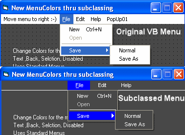



## Change Menu Colors

### Description

Updated: Show Hotkey, Disabled Menus, Seperator, Checked, Better routines, Now you only have to add the module and 1 line of code on your form.

Change all Menucolors (Text, Background, Selection and Selected Text) thru subclassing. Still use VB Menus like allways no extra coding needed. popups are possible. only 16k bigger EXE.
 
### More Info
 

             |
---                |---
**Submitted On**   |2010-08-05 21:20:02
**By**             |[Scythe](https://github.com/Planet-Source-Code/PSCIndex/blob/master/ByAuthor/scythe.md)
**Level**          |Advanced
**User Rating**    |4.7 (14 globes from 3 users)
**Compatibility**  |VB 5\.0, VB 6\.0
**Category**       |[Custom Controls/ Forms/  Menus](https://github.com/Planet-Source-Code/PSCIndex/blob/master/ByCategory/custom-controls-forms-menus__1-4.md)
**World**          |[Visual Basic](https://github.com/Planet-Source-Code/PSCIndex/blob/master/ByWorld/visual-basic.md)
**Archive File**   |[Change\_Men218573852010\.zip](https://github.com/Planet-Source-Code/scythe-change-menu-colors__1-73292/archive/master.zip)

